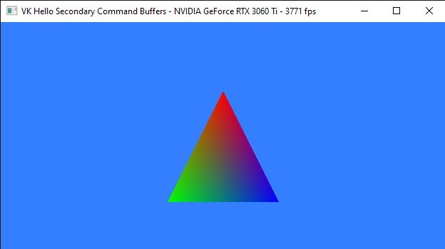
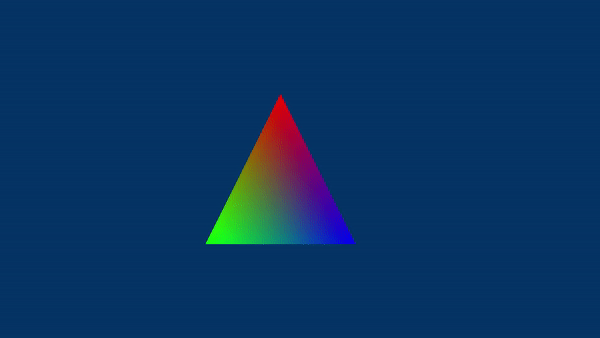
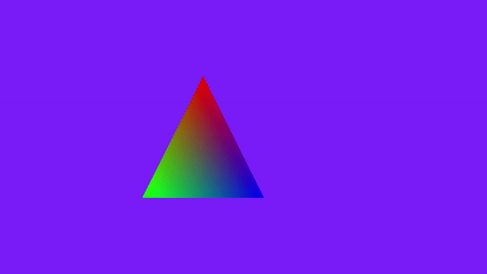
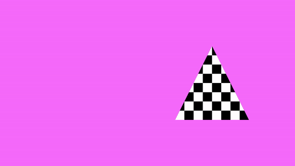
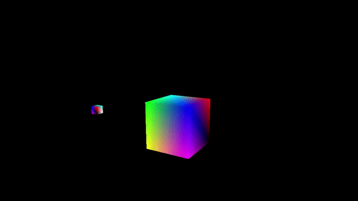

# Learn Vulkan from code samples
## Description
This repository hosts the code of the samples for the tutorial series you can find in the wiki, or at the following link:<br />

[Learn Vulkan from code samples](https://paminerva.github.io/docs/LearnVulkan/LearnVulkan)

<br>

## Repository Dependencies

- Vulkan SDK
- Visual Studio Code with the C/C++ extension installed
- MSVC compiler toolset (on Windows)
- GCC and GDB (on Linux)

<br>

## How to build the samples (both on Windows and Linux)

- Clone this repository using the command ```git clone https://github.com/PAMinerva/LearnVulkan```
- Navigate to the "samples" directory, where you will find a folder for each sample
- Open the project of a sample by opening the corresponding folder with Visual Studio Code
- Open a source file in VS Code, for example src/Main.cpp
- Press <kbd>Ctrl</kbd>+<kbd>Shift</kbd>+<kbd>B</kbd> to compile the sample
- Press <kbd>Ctrl</kbd>+<kbd>F5</kbd> to compile and run the sample
- Press <kbd>F5</kbd> to compile and debug the sample

<br>

***
As you can see, some tutorials are almost comparable to book chapters. It takes a fair amount of time and effort to write such detailed tutorials. So, if you like this project, or if you find it somewhat helpful, please consider supporting further development by clicking on the **Sponsor** button. Whether a small tip, a one time donation, or a recurring payment, it's all welcome! Thank you! <br>
***

<br>

## Samples

<table>
 <tr>
  <td><a href="https://github.com/PAMinerva/LearnVulkan/tree/master/samples/01A-VkHelloWindow">01.A - Hello Window</a></td>
  <td><a href="https://github.com/PAMinerva/LearnVulkan/tree/master/samples/01B-VkHelloTriangle">01.B - Hello Triangle</a></td>
 </tr>
 <tr>
  <td></td>
  <td></td>
 </tr>
 <tr>
  <td><a href="https://github.com/PAMinerva/LearnVulkan/tree/master/samples/01C-VkHelloSCBs">01.C - Hello Secondary CBs</a></td>
  <td><a href="https://github.com/PAMinerva/LearnVulkan/tree/master/samples/01D-VkHelloUniforms">01.D - Hello Uniforms</a></td>
  <!-- <td> </td>  -->
 </tr>
  <tr>
  <td></td>
  <td></td>
  <!-- <td> </td>  -->
 </tr>
 <td><a href="https://github.com/PAMinerva/LearnVulkan/tree/master/samples/01E-VkHelloFrameBuffering">01.E - Hello Frame Buffering</a></td>
  <td><a href="https://github.com/PAMinerva/LearnVulkan/tree/master/samples/01F-VkHelloTextures">01.F - Hello Textures</a></td>
  <!-- <td> </td>  -->
 </tr>
  <tr>
  <td></td>
  <td></td>
  <!-- <td> </td>  -->
 </tr>
 <tr>
  <td>01.G - Hello Transformations</td>
  <td>01.H - Hello Lighting</td>
  <!-- <td> </td>  -->
 </tr>
  <tr>
  <td></td>
  <td></td>
  <!-- <td> </td>  -->
 </tr>
</table>

<br>

<br>

## Credits
* https://github.com/KhronosGroup <br />
* https://github.com/SaschaWillems
