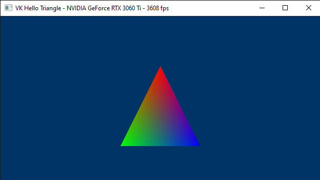

# Learn Vulkan from code samples
## Description
This repository hosts the code of the samples for the tutorial series you can find in the wiki, or at the following link: 

[Learn Vulkan from code samples](https://paminerva.github.io/docs/LearnVulkan/LearnVulkan)

 

***
As you can see, some tutorials are almost comparable to book chapters. It takes a fair amount of time and effort to write such detailed tutorials. So, if you like this project, or if you find it somewhat helpful, please consider supporting further development by clicking on the **Sponsor** button. Whether a small tip, a one time donation, or a recurring payment, it's all welcome! Thank you!  
***

 

## Samples

<table>
 <tr>
  <td><a href="https://github.com/PAMinerva/LearnVulkan/tree/master/samples/01A-VkHelloWindow">01.A - Hello Window</a></td>
  <td>01.B - Hello Triangle</td>
 </tr>
 <tr>
  <td></td>
  <td></td>
  <!-- <td> </td>  -->
 </tr>
</table>

 

 

## Credits
* https://github.com/KhronosGroup  
* https://github.com/SaschaWillems
